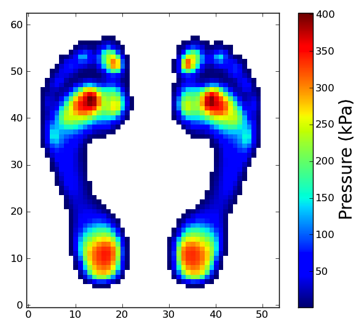

# mun104
MUN104: Plantar pressure distribution template computed from 104 individuals from Munster University, Germany.


<p align="left">
  
</p>


Overview
-----------------------------------------
These are the MUN104 left- and right- plantar pressure distribution templates, computed from 104 subjects at the University of Münster, Germany.

Recommended uses: as a datum for comparisons with individuals and/or other populations.


Data
-----------------------------------------

<a href="MUN104.h5.zip" download>MUN104.h5.zip</a> (for Matlab, Python, C, etc.)
<a href="MUN104.csv.zip" download>MUN104.csv.zip</a> (comma-separated ASCII format)


Reference
-----------------------------------------
Pataky TC, Bosch K, Mu T, Keijsers NLW, Segers V, Rosenbaum D, Goulermas JY (2011). 
An anatomically unbiased foot template for inter-subject plantar pressure evaluation. 
Gait and Posture 33(3): 418-422.


Loading and viewing the data (MATLAB)
-----------------------------------------

```matlab
file_name = 'MUN104L.h5'; 
I = hdf5read(file_name, '/I'); 
I = double( I' ); 
h = pcolor(I); 
set(h, 'facecolor','flat', 'edgecolor','none') 
axis image
```


Loading and viewing the data (Python)
-----------------------------------------

```python
import tables 
from matplotlib import pyplot 
file_name = 'MUN104L.h5' 
file_id = tables.openFile(file_name, mode='r') 
I = file_id.getNode('/I').read() 
file_id.close() 
pyplot.imshow(I, origin='lower', interpolation='nearest') 
pyplot.show()
```


Data format
-----------------------------------------
HDF5 is an open data format, excellent for the fast reading-and-writing of large datasets. 
Please find more information at: <a href="http://www.hdfgroup.org/HDF5/">www.hdfgroup.org/HDF5</a> (for Matlab, Python, C, etc.)


Copyright (c) 2011 Todd Colin Pataky, Kerstin Bosch, and Dieter Rosenbaum